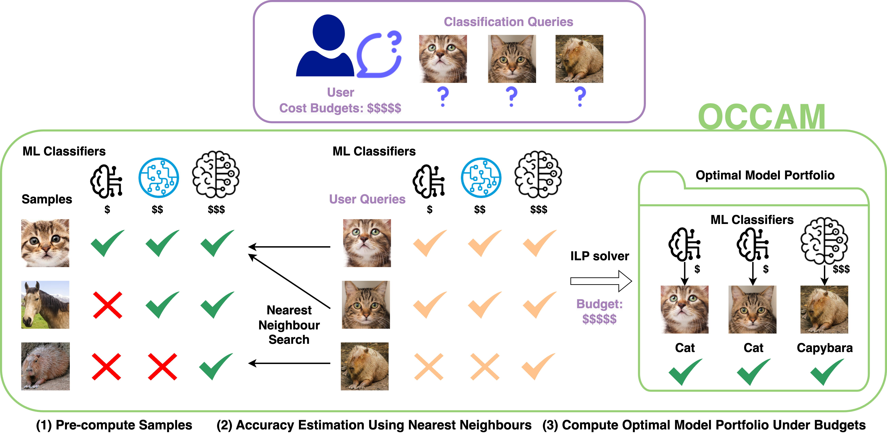

# [OCCAM: Towards Cost-Efficient and Accuracy-Aware Classification Inference](https://openreview.net/forum?id=CUABD2qIB4) (ICLR 2025)

## Overview


<details>
<summary>Abstract</summary>
 Classification tasks play a fundamental role in various applications, spanning domains such as healthcare, natural language processing and computer vision. With the growing popularity and capacity of machine learning models, people can easily access trained classifiers as a service online or offline. However, model use comes with a cost and classifiers of higher capacity (such as large foundation models) usually incur higher inference costs. To harness the respective strengths of different classifiers, we propose a principled approach, OCCAM, to compute the best classifier assignment strategy over classification queries (termed as the optimal model portfolio) so that the aggregated accuracy is maximized, under user-specified cost budgets. Our approach uses an unbiased and low-variance accuracy estimator and effectively computes the optimal solution by solving an integer linear programming problem. On a variety of real-world datasets, OCCAM achieves 40% cost reduction with little to no accuracy drop.
</details>

## Usage

### Running Environment
- Python 3.8.10
- Cuda 11.2.2
- PyTorch 1.13.0
- torchvision 0.14.0
- numpy 1.22.2

### Dataset Preparation
We download CIFA10, CIFAR100, and ImageNet datasets using [torchvision.datasets](https://pytorch.org/vision/stable/datasets.html) and prepare Tiny ImageNet dataset as follows
```bash
# download Tiny ImageNet dataset
bash tinyimagenet_download.sh
# get self-defined train, val, and test splits
python tinyimagenet_splits.py
```

### Feature Extraction
Extract features using pre-trained models from [torchvision.models](https://pytorch.org/vision/stable/models.html) to train classifiers, because all these models are pre-trained on ImageNet-1K which has a different class label output dimension than other datasets. Note the feature here is different from the one in the paper, which is "the last layer output of an ML model (e.g., ResNet-18)  trained on the target dataset,
given an input image".
```bash
# network_name in ["resnet18", "resnet34", "resnet50", "resnet101", "swin_v2_t", "swin_v2_s", "swin_v2_b"]
# dataset_name in ["cifar10", "cifar100", "tiny-imagenet-200"]
python extract_feature.py --network "swin_v2_t" --dataset "tiny-imagenet-200"
```

### Training Classifiers
Train classifiers and save predictions.
```bash
# network_name in ["resnet18", "resnet34", "resnet50", "resnet101", "swin_v2_t", "swin_v2_s", "swin_v2_b"]
# dataset_name in ["cifar10", "cifar100", "tiny-imagenet-200"]
python train_classifier.py --feature "nn_feature_np" --network "swin_v2_t" --dataset "tiny-imagenet-200"
```

### ImageNet Inference
We use the pre-trained models from [torchvision.models](https://pytorch.org/vision/stable/models.html) and perform inference on ImageNet dataset without fine-tuning.
```bash
# network_name in ["resnet18", "resnet34", "resnet50", "resnet101", "swin_v2_t", "swin_v2_s", "swin_v2_b"]
python imagenet_classifier_inference.py --network "swin_v2_t" --dataset "imagenet"
```

### OCCAM
Run OCCAM to compute the optimal model portfolio using the notebook for different datasets (i.e., CIFAR10, CIFAR100, Tiny ImageNet, and ImageNet) and the 7 models. 
- [whole_pipeline_1nn_Swin_ResNet_CIFAR10.ipynb](./notebooks/whole_pipeline_1nn_Swin_ResNet_CIFAR10.ipynb)
- [whole_pipeline_1nn_Swin_ResNet_CIFAR100.ipynb](./notebooks/whole_pipeline_1nn_Swin_ResNet_CIFAR100.ipynb)
- [whole_pipeline_1nn_Swin_ResNet_TinyImageNet.ipynb](./notebooks/whole_pipeline_1nn_Swin_ResNet_TinyImageNet.ipynb)
- [whole_pipeline_1nn_Swin_ResNet_ImageNet.ipynb](./notebooks/whole_pipeline_1nn_Swin_ResNet_ImageNet.ipynb)

## Citation 
```bibtex
@inproceedings{ding2025occam,
    title={{OCCAM}: Towards Cost-Efficient and Accuracy-Aware Classification Inference},
    author={Dujian Ding and Bicheng Xu and Laks V. S. Lakshmanan},
    booktitle={The Thirteenth International Conference on Learning Representations},
    year={2025},
    url={https://openreview.net/forum?id=CUABD2qIB4}
}

```
